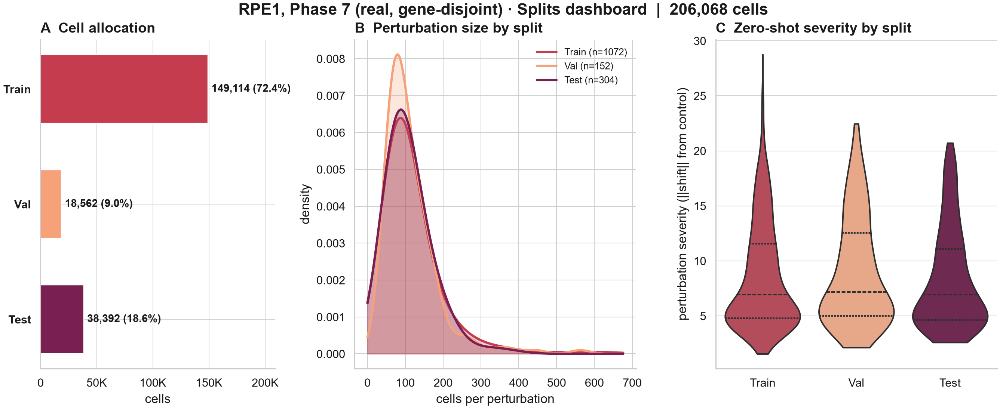
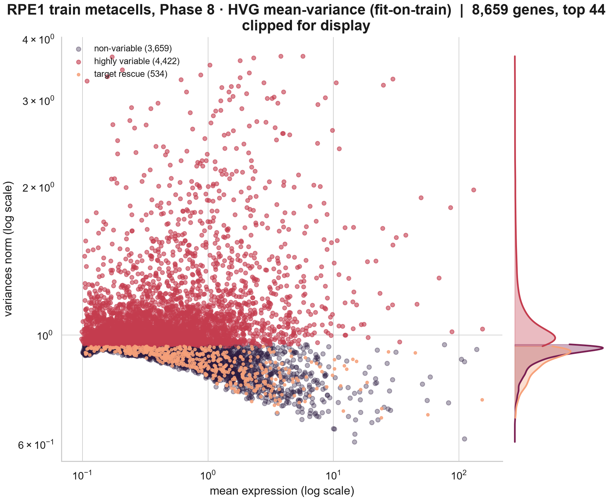
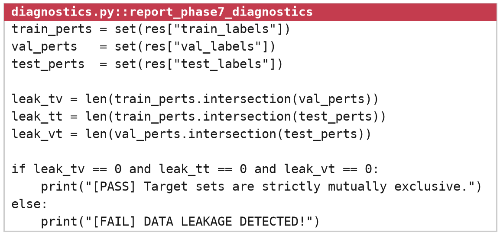

# SPORE: Systematic Preprocessing and Optimization for Robust Evaluation

**SPORE turns a raw, million-cell CRISPR Perturb-seq screen into a clean dataset that a gene regulatory network or perturbation model can be trained on and judged against without leakage.**

    



> [!NOTE]
> SPORE is a work in progress. This version is a one-stop rebuild that folds every fix from the thesis runs into the code itself, so a single command now produces the finished dataset and a report that proves it. The rebuild passes static checks but has not yet completed a full end-to-end run on disk, so read [`docs/KNOWN_ISSUES.md`](docs/KNOWN_ISSUES.md) before the first run and expect interfaces to change.

---

## What SPORE is

A Perturb-seq screen silences one gene per cell and measures how the rest of the transcriptome responds. It is the richest data available for learning which genes control which others, and it arrives in a state no model should read directly. Ambient RNA, doublets and dying cells add correlations that look like regulation. Some cells carry a guide label and escape the knockdown entirely. And if cells from one perturbation land on both sides of a train/test split, a model can score well by recognizing a signature it has already seen.

SPORE is the preparation stage that removes those problems before any inference runs. It cleans the cells, checks every knockdown against the controls, splits the data so that held-out perturbations never touch training, and shapes the training split into the substrate a network generator reads. It was built as the first stage of [FUNGI](https://github.com/PatrickSheehan053/FUNGI), a pipeline for cell-specific regulatory networks, and it runs on its own as a general Perturb-seq cleaner.

## What it is for

* **Cleaning a Perturb-seq screen once, reproducibly.** Every threshold lives in one YAML config, every phase is logged, and the same config gives the same output.
* **Zero-shot benchmarks that mean something.** The split holds out whole perturbations, so a model is graded on genetic states it has never seen.
* **Feeding graph inference.** SPORE writes the raw-count HVG panel and a control-preserving metacell substrate that network generators read directly.
* **Running at genome scale.** The matrix stays sparse throughout, the heaviest phases run in worker subprocesses, and a cluster runner ships one dataset per SLURM array task.

---

## Highlights

* **Leakage is closed by construction.** SPORE splits on whole perturbations, stratified by transcriptional severity, and checks that training shares no target gene with validation or test. Only the training split ever reaches network inference.
* **Held-out targets stay in the panel automatically.** Phase 8 reads the split and force-carries every validation and test target into the gene panel, so a held-out perturbation always has a node to predict. On RPE1 the fixes behind this lifted held-out targets present in the final graph from 23% to 78% on validation and from 26% to 82% on test, with the remainder being genes that were perturbed but never measured.
* **Regulators survive feature selection.** Variance-based selection drops conserved, steadily expressed transcription factors, which are the genes a regulatory network most needs. SPORE rescues every perturbation target and a curated, tiered list of master regulators per cell line, and a user can extend it with any gene set, such as the targets of a drug screen.
* **Knockdowns are verified, not assumed.** Phase 5 tests each guide-bearing cell against the control distribution of its target and removes the escapers, with the direction set by the modality (CRISPRi, CRISPRa or knockout).
* **The controls stay sharp.** The metacell stage pools perturbed cells into MiniBatchKMeans k=2 metacells and keeps every non-targeting control as a single cell, so the reference that every effect is measured against is never blurred.
* **The run proves its own output.** SPORE validates the config against the data before any compute and finishes with a verification gate that writes `COVERAGE_REPORT.md`. The run exits non-zero unless held-out coverage is at the measurable ceiling, the training firewall holds, and the substrate is raw counts on the HVG panel.
* **Genome scale on modest hardware.** The 1.99-million-cell K562 screen stores as a 62 GB dense matrix and about 5 GB sparse after Phase 0.



*Highly variable gene selection on the RPE1 training split. The variance-selected core is joined by rescued perturbation targets and cell-cycle genes that a top-n cut would drop. The selection is fit on the training split alone.*

---

## How it works

SPORE runs as thirteen numbered phases. Each one reads the previous output and writes its own, so every transformation is auditable and a crashed run can resume.

| phase | stage | what it does |
|---|---|---|
| 0 | Ingestion | Reads the raw `.h5ad` and converts it to sparse in chunks, cached so it runs once. |
| 1 | Detection | Read-only. Infers modality, gene-ID format, single or combinatorial guides, and cell-line labels, and harmonizes gene IDs. |
| 2 | Cell triage | Filters cells on UMI count, genes per cell and mitochondrial fraction. Ribosomal perturbation targets are exempt from the ribo filter. |
| 3 | Ambient RNA | Scores ambient contamination and flags likely empty or dying droplets. |
| 4 | Doublets | Scrublet, fit on a subsample and projected for datasets above about 150k cells. |
| 5 | Escapers | Removes cells whose target gene did not move against the controls and scores knockdown efficiency per guide. |
| 6 | Gene triage | Drops genes too sparse to carry signal and rescues every perturbation target. |
| 7 | Splits | Zero-shot, gene-disjoint train/val/test split stratified by transcriptional severity. |
| 8 | HVG selection | Seurat v3 on the training split, plus protected regulators and automatic held-out target force-carry. Writes the raw-count HVG panel. |
| 9 | Normalization | Library-size scaling and an in-place log transform. |
| 10 | Confounders | PCA fit on a subsample, Harmony batch correction, cell-cycle scoring. |
| 11 | Cell lines | Separates mixed cell lines from labels or clustering, with a stability check. |
| 12 | Metacells | Control-preserving MiniBatchKMeans k=2 substrate plus a train-only hybrid file for graph inference. |

The verification gate runs after Phase 12. Each phase in depth, with the figures from a full RPE1 run, is in [`docs/HOW_IT_WORKS.md`](docs/HOW_IT_WORKS.md).



*The firewall as a single assertion. Training perturbations share no gene with validation or test, and only the training split flows on to network inference.*

---

## Two runners, one pipeline

Both runners call the same `src/` and produce identical outputs. Pick the one that matches the machine.

| | `spore_local.py` | `spore_cluster.py` |
|---|---|---|
| built for | a workstation or laptop (8 CPUs, 64 GB is typical) | a SLURM cluster (32+ CPUs, 256+ GB) |
| datasets | one config per run | one config, or a batch file listing several |
| large screens | `--subset-first` keeps the top perturbations and samples cells in a memory-safe two-pass read | full dataset, one array task per dataset |
| CPUs | `runtime.n_jobs` from the config | `$SLURM_CPUS_PER_TASK` |
| figures | on | off unless `--figures` |
| extras | `--estimate` prints a RAM and time estimate | `--print-sbatch` writes the submission script |

---

## Getting started

```bash
git clone https://github.com/PatrickSheehan053/SPORE.git
cd SPORE
pip install -r requirements.txt
```

Point a config at your raw `.h5ad`, then run on a workstation:

```bash
python spore_local.py --config configs/spore_config_rpe1.yaml --estimate   # RAM / time estimate
python spore_local.py --config configs/spore_config_rpe1.yaml              # full run
```

Or on a cluster:

```bash
python spore_cluster.py --config configs/spore_config_k562.yaml --print-sbatch > submit_spore.sh
sbatch submit_spore.sh
```

Every run needs fresh output directories. SPORE refuses to start if `processed_dir` or `splits_dir` already holds `.h5ad` files, because files left from an earlier run would silently mix into the new one. Pass `--resume` only to continue a crashed run on purpose.

### What comes out

| file | use |
|---|---|
| `{name}_train/val/test.h5ad` | the zero-shot splits |
| `{name}_split_indices.json` | which perturbation went to which split |
| `{name}_{split}_hvgraw.h5ad` | raw counts on the HVG panel, the input most graph generators want |
| `{name}_allsplits_metacell_ctrlpreserved.h5ad` | the control-preserving metacell substrate |
| `{name}_train_hybrid.h5ad` | training units only, the file a network generator should read |
| `COVERAGE_REPORT.md` / `.json` | held-out coverage, firewall check and the gate verdict |

### Repository layout

```
SPORE/
  spore_local.py          workstation runner
  spore_cluster.py        SLURM runner
  src/                    the 13 phases, shared by both runners
  configs/                configs for RPE1, K562 and VCC h1-hESC
  protected_genes/        curated regulator lists per cell line
  tools/                  helper for finding the perturbation and control labels in a new dataset
  docs/                   guides, known issues, provenance, figures
```

---

## Roadmap

* **A full end-to-end run of this rebuild** on VCC h1-hESC, RPE1 and K562, checked against the July 2026 cluster runs, with each `COVERAGE_REPORT.md` committed as a reference.
* **Cluster validation of the large-dataset worker path** at full K562 scale.
* **CHITIN**, a phase that estimates and removes the shared cell-cycle-arrest response every essential-gene knockdown drives, returning once it beats the signal it subtracts from.
* **Packaging** as an installable module with a test suite on a small public dataset.

---

## Read more

SPORE is Chapter 2 of the Master's thesis that introduced the full pipeline. The thesis uses the original pipeline name, MYCELIUM.

* **Thesis (PDF):** [Sheehan_2026_MYCELIUM_thesis.pdf](https://github.com/PatrickSheehan053/FUNGI/blob/main/docs/thesis/Sheehan_2026_MYCELIUM_thesis.pdf)
* **The full pipeline:** [FUNGI](https://github.com/PatrickSheehan053/FUNGI)
* **How it works:** [`docs/HOW_IT_WORKS.md`](docs/HOW_IT_WORKS.md)
* **Known issues:** [`docs/KNOWN_ISSUES.md`](docs/KNOWN_ISSUES.md)
* **Changes from the first release:** [`CHANGELOG.md`](CHANGELOG.md)

If you use SPORE, please cite the thesis until the preprint is out:

```
Sheehan, P. (2026). MYCELIUM: A Unified Pipeline for Causal Gene Regulatory Network
Inference from Single-Cell Perturbation Data. MSc thesis, University of Milan / Human Technopole.
```

---

## Acknowledgements

SPORE began as part of a Master's thesis in Quantitative Biology at the University of Milan, hosted at Human Technopole under the supervision of Dr. Andrea Sottoriva, with Dr. Beatrice Bodega as internal advisor.

## References

1. Replogle, J. M. et al. Mapping information-rich genotype-phenotype landscapes with genome-scale Perturb-seq. *Cell* 185, 2559–2575 (2022).
2. Wolf, F. A., Angerer, P. & Theis, F. J. SCANPY: large-scale single-cell gene expression data analysis. *Genome Biol.* 19, 15 (2018).
3. Wolock, S. L., Lopez, R. & Klein, A. M. Scrublet: computational identification of cell doublets in single-cell transcriptomic data. *Cell Syst.* 8, 281–291 (2019).
4. Korsunsky, I. et al. Fast, sensitive and accurate integration of single-cell data with Harmony. *Nat. Methods* 16, 1289–1296 (2019).
5. Stuart, T. et al. Comprehensive integration of single-cell data. *Cell* 177, 1888–1902 (2019).

## License

MIT. See [`LICENSE`](LICENSE).
