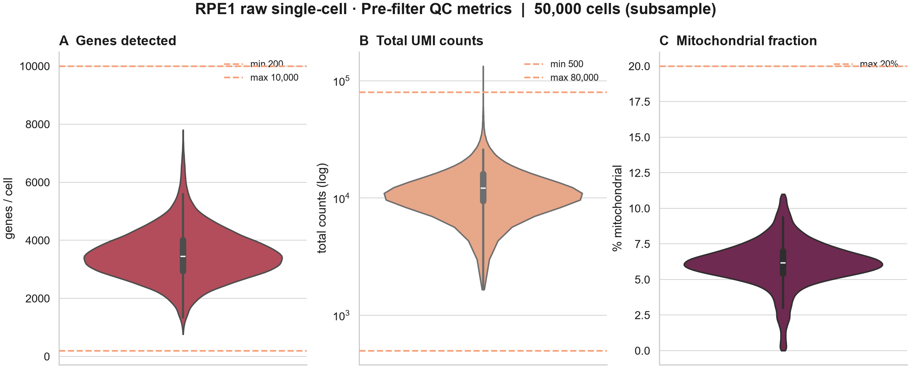
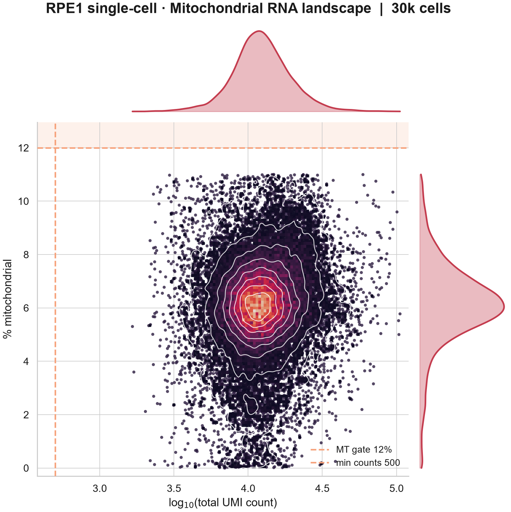
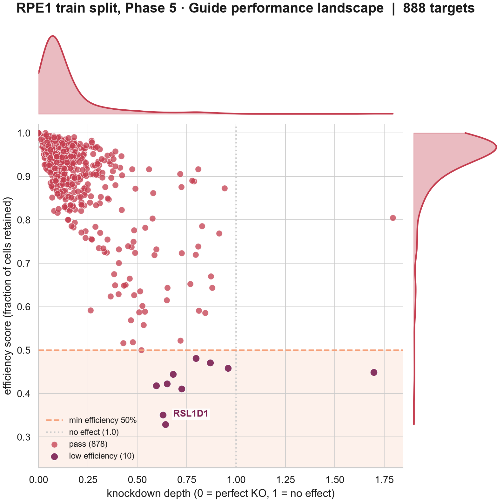
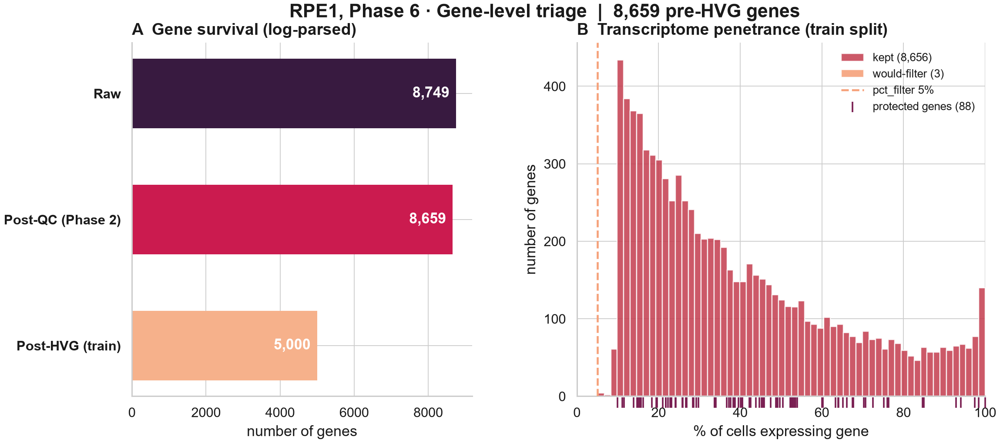
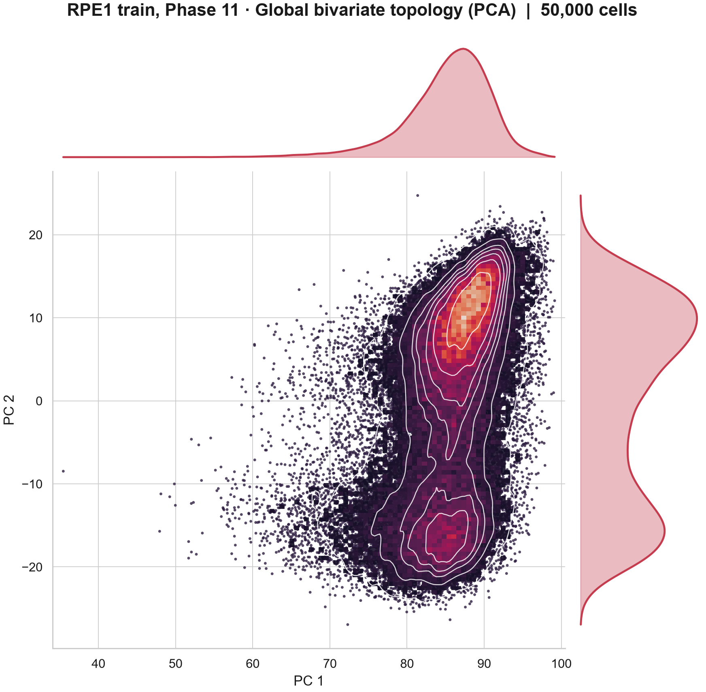
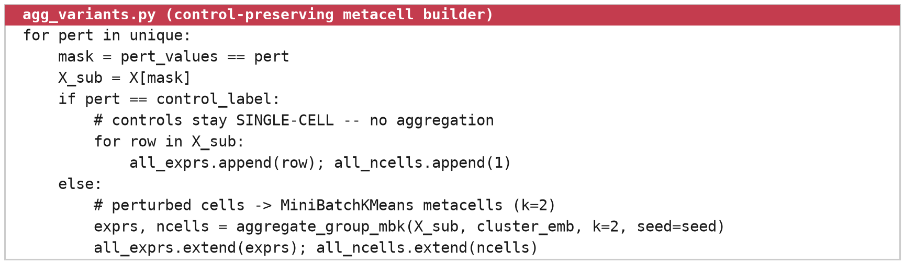

# How SPORE works

SPORE has two jobs. The first is cleaning, removing the technical artifacts and mislabeled cells that an inference method would otherwise read as biology. The second is splitting, dividing the data so that a network is built and judged without any information leaking from the perturbations held back for testing. Phases 0 to 6 clean, Phase 7 splits, and Phases 8 to 12 shape the training data into the substrate a network generator reads. The figures below come from a full run on the RPE1 essential-gene screen of Replogle et al. (2022). Chapter 2 of the [thesis](https://github.com/PatrickSheehan053/FUNGI/blob/main/docs/thesis/Sheehan_2026_MYCELIUM_thesis.pdf) covers the same ground with full citations.

## Design principles

* **Numbered phases.** Each phase reads the previous output and writes its own, so every step can be audited and a crashed run can resume with `--resume`.
* **Self-configuring.** Phase 1 inspects the data and infers what later phases need, so a new dataset needs a config, not code changes. `tools/label_detection.py` suggests the `dataset:` block for an unfamiliar file.
* **Memory-safe.** The matrix stays sparse from Phase 0 on, and the heaviest phases (8 and 10) move into worker subprocesses above `runtime.large_dataset_threshold` cells so a multi-million-cell screen stays inside a fixed memory budget.
* **Fail early, fail loudly.** The config is checked against the data before any compute, and a verification gate checks the output before the run reports success.
* **Train-only learning.** Every step that learns something from the data after the split (gene selection, PCA, batch correction) learns it on the training split and applies it to validation and test.

## Before any compute: config validation

SPORE opens the raw file and stops with exit code 1 if the config contradicts the data. It checks that `perturbation_col` and `control_label` exist in `obs`, that the batch key exists when batch correction is on, that `gene_id_format` matches the gene names, and that `test_n + val_n` leaves perturbations for training. Without `--resume` it also refuses to start if the output folders already hold `.h5ad` files, since stale files from an earlier run are read back by later phases.

## Phases 0 and 1: ingestion and detection

Phase 0 reads the raw `.h5ad` and converts the matrix to sparse in chunks, caching the result so the conversion runs once. On the 1.99-million-cell K562 screen this takes a 62 GB dense matrix to about 5 GB. Phase 1 is read-only. It infers the modality, the gene-ID format, whether guides are single or combinatorial, and any cell-line labels, and it harmonizes gene IDs to symbols, using a symbol column in the file when one exists and the mygene service otherwise.

## Phases 2 to 4: cell-level quality control

Phase 2 computes per-cell UMI counts, genes per cell and mitochondrial fraction, and drops cells outside the configured gates. The mitochondrial gate relaxes for single-nucleus data. Ribosomal genes that are perturbation targets or on the protected list are exempt from the ribosomal filter, a fix that restored ribosomal knockdowns the first release silently removed.

*Genes per cell, total UMI (log scale) and mitochondrial content before filtering, with the acceptance thresholds marked.*

Phase 3 estimates ambient RNA, from empty droplets when the raw matrix is available or as a global expression signature otherwise, and flags cells that pair a high ambient score with a low UMI count. Phase 4 scores doublets with Scrublet. Above about 150,000 cells it fits Scrublet on a subsample and projects the rest, which keeps the cost linear.

*The joint QC landscape. The retained population and the flagged zone are shaded, and white contours mark where real single cells concentrate.*

## Phase 5: escapers and knockdown efficiency

A cell can pass every QC gate and still carry the wrong label. Phase 5 compares each guide-bearing cell's target expression against that gene's distribution in the non-targeting controls and removes cells that did not move. The direction follows the modality, so CRISPRi and knockout keep strongly silenced cells and CRISPRa keeps strongly induced ones. The same test gives each perturbation a knockdown-efficiency score, and each gene in a combinatorial label is tested against its own control distribution. Perturbations left with too few cells are dropped.

*Knockdown efficiency against knockdown depth per target. Targets below the efficiency threshold are escapers.*

## Phase 6: gene-level triage

Phase 6 drops genes too sparse or too lowly expressed to carry signal. Every perturbation target is rescued, so a silenced regulator is never removed for being lowly expressed.

*Gene counts through the filtering stages (left) and the penetrance distribution split into kept and filtered genes (right).*

## Phase 7: the zero-shot split

Phase 7 assigns whole perturbations to train, validation or test, so no cell of a held-out perturbation is ever seen in training. Splitting by cell instead would let a model score well by recognizing a perturbation's signature rather than predicting its effect, and because the shared stress response makes unrelated perturbations look partly alike, that leak is wider than it first appears.

Each perturbation is scored by the size of its mean shift away from the controls and binned by that severity, and the three splits sample proportionally from every bin, so none of them collects the easy or the hard perturbations. Split sizes can be set as counts (`test_n`, `val_n`) so a large panel does not produce a uselessly small test set. The assignment is written to `{name}_split_indices.json`.

*Cells per split (left), perturbation severity per split (centre) and zero-shot difficulty per split (right). The three splits carry the same difficulty.*

*The gene-disjoint guarantee. Only the training split flows on to network inference.*

## Phase 8: gene selection with protection

Phase 8 picks a few thousand highly variable genes with the Seurat v3 method, fit on the training split alone. Variance-based selection has a blind spot here. Conserved transcription factors are held at steady, modest expression, so a top-n cut drops exactly the hub regulators a network exists to recover. Three mechanisms put them back.

1. **Every perturbation target** is rescued.
2. **A curated protected list** per cell line (`protected_genes/`), organized in priority tiers from core identity regulators to broader pathway and chromatin context. A user can add any gene set, such as the 227 targets of the Tahoe drug screen.
3. **Automatic held-out force-carry.** Phase 8 reads the split file and adds every validation and test target to the panel, so a held-out perturbation always has a node to predict. It then prints a coverage report listing any held-out target still missing and whether it was ever measured.

Phase 8 writes `{name}_{split}_hvgraw.h5ad`, the HVG panel in raw counts, before normalization. This is the input Phase 12 and most graph generators read.

*The mean-variance plane on the training split, with the variance-selected core and the rescued targets and cell-cycle genes marked.*

## Phases 9 to 11: normalization, confounders, cell lines

Phase 9 scales each cell to a common total and log-transforms in place, which avoids a full copy of the matrix. Phase 10 fits PCA on a representative subsample, projects every cell, applies Harmony to remove batch structure and scores cell-cycle phase, then drops the temporary cell-cycle marker genes so the panel stays at its intended size. Phase 11 separates mixed cell lines, reading labels when they exist, clustering to a known count when one is given, and otherwise clustering automatically with a stability check. It confirms that the detected groups differ in regulatory direction and not only in intensity before splitting them.

*RPE1 training cells after the full pipeline, PC1 against PC2 with marginals.*

## Phase 12: the control-preserving metacell substrate

Single cells are sparse, and pooling similar cells under the same perturbation gives a steadier estimate of expression. Pooling everything is the wrong move, because the non-targeting controls are the reference that every effect, the escaper test and the co-expression structure are measured against. Phase 12 therefore pools only the perturbed cells. Within each perturbation it clusters cells with MiniBatchKMeans into `n_cells // k` groups (k=2 by default, so about two cells per metacell) and averages their raw counts, while every control cell stays single.

*Perturbed cells aggregate, controls stay single.*

It writes three files and stops on any violation of its guards (controls single-cell, splits disjoint and complete, one perturbation per metacell).

* `{name}_allsplits_metacell_ctrlpreserved.h5ad` holds every unit with a `split` column.
* `{name}_train_hybrid.h5ad` holds training units and controls only. This is the file a network generator should read.
* `{name}_allsplits_metacell_split_indices.json` maps units to splits.

## The verification gate

After Phase 12 SPORE checks its own output and writes `COVERAGE_REPORT.md` and `.json`. The run passes only if all three checks hold.

1. Every held-out target that was measured is present in the panel. Targets that were perturbed but never measured are listed as the data's ceiling.
2. The train hybrid holds zero validation or test units.
3. The substrate is raw counts on the HVG panel.

A failed gate exits with code 2 and the report says which check failed.

## What is not here

CHITIN, the phase that estimates and subtracts the shared cell-cycle-arrest program every essential-gene knockdown drives, is not part of this release. It is described in Chapter 2.5 of the thesis and will return once it passes its own controls.
